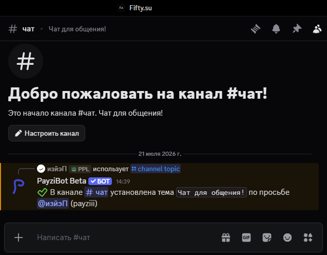

## Управление пользователями

### Блокировка пользователя

> Команда - `/ban`
>
> Аргументы - `пользователь*`, `причина`

Блокирует определенного пользователя по указанной причине. В случае отсутствия причины будет указано имя пользователя модератора

### Исключение пользователя

> Команда - `/kick`
>
> Аргументы - `пользователь*`, `причина`

Исключает определенного пользователя по указанной причине с сервера. В случае отсутствия причины будет указано имя пользователя модератора

### Заглушение пользователя

> Команда - `/mute`
>
> Аргументы - `пользователь*`, `время*`, `причина`

"Мутит" пользователя на сервере на определенное время.
Время мута можно выбрать из следующих вариантов: `1 минута`, `10 минут`, `30 минут`, `1 час`, `2 часа`, `6 часов`, `12 часов`, `24 часа`, `7 суток`

### Разглушение пользователя

> Команда - `/unmute`
>
> Аргументы - `пользователь*`, `причина`

"Размучивает" пользователя

## Управление каналами

### Очистка сообщений

> Команда - `/clear`
>
> Аргументы - `количество*`

Удаляет указанное количество сообщений в канале, в котором выполнена команда.
Из-за технических ограничений невозможно очистить более 100 сообщений за раз, а также сообщения, написанные позднее 2 недель

### Закрытие канала

> Команда - `/channel lock`

Отбирает у `@everyone` права на отправку сообщений, просмотр канала и чтение истории сообщений

### Открытие канала

> Команда - `/channel unlock`

Выдает `@everyone` права на отправку сообщений, просмотр канала и чтение истории сообщений

### Установка темы канала

> Команда - `/channel topic`
>
> Аргументы - `тема*`

Устанавливает тему канала (см. скриншот ниже)

