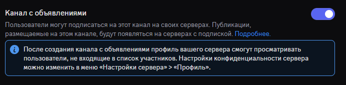

import Aside from 'starlight-plugin-icons/components/Aside.astro'

## Цвета эмбеда

### Изменение цветов эмбеда

> Команда - `/configuration color`

Дает возможность изменить цвета эмбедов, отправляемые PayziBot

## Приветственные сообщения

### Просмотр настроек приветствия

> Команда - `/welcome overview`

Выведет все установленные настройки системы приветственных сообщений

### Отключить приветственные сообщения

> Команда - `/welcome off`

Отключает систему приветственных сообщений

### Установка приветственного сообщения

> Команда - `/welcome setup`
>
> Аргументы - `канал*`

Устанавливает приветственное сообщение в указанном канале

### Установка автороли

> Команда - `/welcome autorole`
>
> Аргументы - `роль*`

При заходе на сервер всем новым пользователям будет автоматически выдаваться указанная роль

## Прощальные сообщения

### Просмотр настроек прощания

> Команда - `/goodbye overview`

Выведет все установленные настройки системы прощальных сообщений

### Отключить прощательные сообщения

> Команда - `/goodbye off`

Отключает систему прощательных сообщений

### Установка прощального сообщения

> Команда - `/goodbye setup`
>
> Аргументы - `канал*`

Устанавливает прощательное сообщение в указанном канале

## Звездная доска

### Просмотр настроек звездной доски

> Команда - `/starboard overview`

Выведет все установленные настройки системы звездной доски

### Отключить звездную доску

> Команда - `/starboard off`

Отключает систему звездной доски

### Установка канала звездной доски

> Команда - `/starboard channel-set`
>
> Аргументы - `канал*`

Устанавливает канал, в который будут отправляться "звездные" сообшения

### Установка количества звезд

> Команда - `/starboard stars-needed`
>
> Аргументы - `количество*`

Устанавливает количество звезд, необходимых под сообщением пользователя, для попадания на звездную доску

### Установка кастомной реакции

> Команда - `/starboard custom-react`
>
> Аргументы - `реакция*`

Устанавливает реакцию, которая будет работать вместо звезды

## Роли за реакции

### Просмотр настроек ролей за реакции

> Команда - `/rolereact overview`

Выведет все установленные настройки системы ролей за реакции

### Установка ролей за реакции

> Команда - `/rolereact set`
>
> Аргументы - `роль*`, `реакция*`, `id*`, `канал*`

Устанавливает на сообщении с указанным id в указанном канале реакцию, при нажатии на которую любой пользователь получит указанную роль

### Удаление ролей за реакции

> Команда - `/rolereact delete`
>
> Аргументы - `id*`

Удаляет с указанного сообщения все роли за реакции

## Автореакции

### Просмотр настроек автореактинга

> Команда - `/autoreact overview`

Выведет все установленные настройки автореактинга

### Отключить автореактинг

> Команда - `/autoreact off`

Отключает автореактинг

### Установка автореактинга

> Команда - `/autoreact set`
>
> Аргументы - `канал*`, `реакции*`, `порядок`

Автоматически устанавливает в указанном канале указанные реакции под каждым новым сообщением

Порядки установки:
- Линейный (по умолчанию) - устанавливает реакции в том порядке, в котором вы ввели в аргументе `реакции`
- Случайный - устанавливает реакции в случайном порядке

## Автопубликация

<Aside type="note" icon="i-material-symbols:info-outline-rounded">
  Автопубликация - автоматическая публикация всех сообщений в канале с типом "Канал с объявлениями"

  
</Aside>

### Просмотр списка каналов

> Команда - `/autopublish list`

Выведет все каналы, в которых установлена автопубликация

### Установка автопубликации

> Команда - `/autopublish set`
>
> Аргументы - `канал*`

Устанавливает в указанном канале систему автопубликации

### Удаление автопубликации

> Команда - `/autopublish remove`
>
> Аргументы - `канал*`

Удаляет в указанном канале систему автопубликации